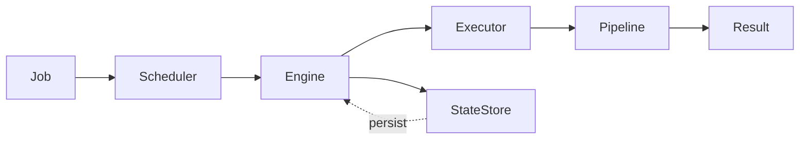
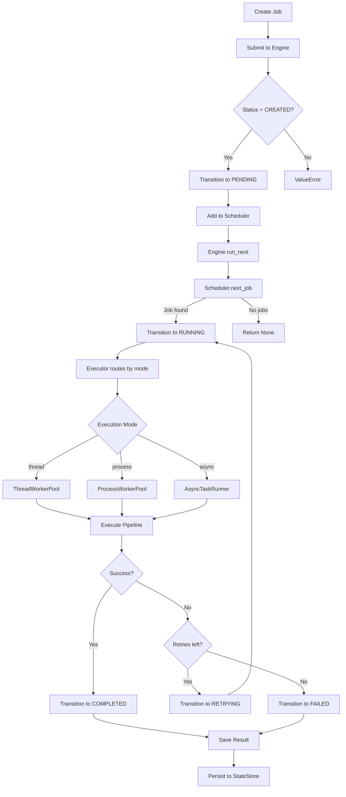

# PYREXIS

> A pure-Python concurrent job execution engine for AI infrastructure workloads.

[]() []() []()

## Why PYREXIS?

PYREXIS focuses on the **infrastructure around AI**, not models:
- **Scheduling** — Fair priority-based job ordering with starvation prevention
- **Retries** — Bounded retry logic with exponential backoff
- **Concurrency** — Thread/process/async execution models
- **Streaming** — Pipeline-based incremental processing
- **Durability** — Persistent state with crash recovery

No ML libraries. No magic. Just reliable job orchestration.

---

## Core Concepts



### **Job** → Unit of work
- Strongly typed with Pydantic
- State machine enforcement
- Priority-based scheduling
- Configurable execution mode (thread/process/async)

### **Scheduler** → Fair ordering
- Priority queue with aging
- Starvation prevention
- Thread-safe operations

### **Engine** → Lifecycle orchestration
- Job submission and state management
- Graceful shutdown coordination
- Metrics collection

### **Pipeline** → Streamed execution
- Multi-stage processing
- Generator-based streaming
- Progress hooks

### **Executor** → Concurrency router
- Threads for I/O-bound tasks
- Processes for CPU-bound tasks
- Async for event-driven orchestration

---

## Minimal Example

```python
from core import Engine, Scheduler, ExecutorRouter
from models import Job, JobStatus
from storage import StateStore
from utils import ShutdownCoordinator

# Setup
scheduler = Scheduler()
executor = ExecutorRouter()
state_store = StateStore("./state.db")
shutdown = ShutdownCoordinator()

engine = Engine(
    scheduler=scheduler,
    executor=executor,
    state_store=state_store,
    shutdown_coordinator=shutdown
)

# Create and submit job
job = Job(
    job_id="task-1",
    priority=5,
    payload={"data": "process_this"},
    execution_mode="thread"
)

engine.submit_job(job)

# Run engine loop
engine.run_loop()  # Processes jobs until shutdown
```

---

## Job Flow



---

## Failure Model

PYREXIS is designed for **graceful degradation**, not perfect uptime:

- ✅ **Crashes are expected** — Jobs retry automatically
- ✅ **Retries are bounded** — Max attempts prevent infinite loops  
- ✅ **Results are immutable** — Once saved, never modified
- ✅ **State is durable** — Persistent storage survives restarts

### Retry Logic
```python
# Job fails during execution
job.record_failure("Connection timeout")

# Automatic retry if attempts < max_retries
if job.attempts < job.max_entries:
    job.status = RETRYING
    # Exponential backoff: 2^attempts seconds
else:
    job.status = FAILED
```

### Shutdown Behavior
- **Graceful shutdown** — No new jobs pulled, current jobs finish
- **Thread pools stop** — Workers exit after current task
- **Process pools terminate** — Clean resource cleanup
- **State persists** — All job states saved before exit

---

## When NOT to Use PYREXIS

| ❌ Use Case | Why Not | Use Instead |
|------------|---------|-------------|
| Real-time systems (< 10ms latency) | Threading/scheduling overhead | Direct function calls |
| Distributed clusters | Single-machine only | Celery, Ray |
| GPU training pipelines | No CUDA awareness | Kubeflow, MLflow |
| High-throughput streaming (>100k jobs/sec) | Not optimized for scale | Kafka, Flink |

### When to use PYREXIS:
- ✅ Orchestrating AI inference pipelines (batch processing)
- ✅ Multi-stage data preprocessing workflows
- ✅ Concurrent API request handling (I/O-bound)
- ✅ CPU-intensive batch computations
- ✅ Retry-heavy external service calls

---

## Installation

```bash
# Clone repository
git clone https://github.com/yourusername/pyrexis.git
cd pyrexis

# Install dependencies (minimal)
pip install pydantic

# Run tests
python -m unittest discover tests
```

---

## Testing Philosophy

PYREXIS has **47 brutal tests** that try to break the system:

- ✅ **Starvation prevention** — Low-priority jobs eventually run
- ✅ **Race conditions** — 500 concurrent job submissions
- ✅ **Retry exhaustion** — Exact max_retries enforcement
- ✅ **State transitions** — Illegal transitions rejected
- ✅ **Graceful shutdown** — No data loss on interrupt

**Key insight**: We test *failure modes*, not just functionality.

```bash
# Run all tests
python -m unittest discover tests -v

# Run specific test category
python -m unittest tests.test_scheduler -v
python -m unittest tests.test_concurrency -v
python -m unittest tests.test_shutdown -v
```

See [docs/TESTING.md](docs/TESTING.md) for detailed testing philosophy.

---

## Project Structure

```
pyrexis/
├── core/               # Engine, Scheduler, Pipeline, Executor
├── models/             # Job and Result data models
├── storage/            # StateStore persistence
├── concurrency/        # Thread/Process/Async pools
├── utils/              # Metrics, Logging, Retry, Shutdown
├── tests/              # 47 brutal test cases
└── docs/               # Architecture and design docs
```

---

## Architecture

See [docs/ARCHITECTURE.md](docs/ARCHITECTURE.md) for detailed system design, including:
- Component interactions
- State machine diagram
- Concurrency model
- Failure recovery strategies

---

## Metrics & Observability

```python
# Access metrics
metrics = engine.get_metrics()

# View counters
print(metrics.get_counters())
# {'job.retries': 3}

# View timings
print(metrics.get_timings())
# {'job.execution': {'count': 10, 'avg': 0.15, 'max': 0.42}}
```

Metrics are thread-safe and collected automatically during execution.

---

## Contributing

We welcome contributions! See [CONTRIBUTING.md](CONTRIBUTING.md) for guidelines:
- Small PRs preferred
- Tests required for all changes
- No new dependencies without discussion
- Readability > cleverness

---

## License

MIT License - see [LICENSE](LICENSE) for details.

---

## Why "PYREXIS"?

*Pyrexis* (πύρεξις) — Greek for "fever" or "intense heat."  
A fitting name for a system that orchestrates intense computational workloads.

---

**Built for engineers who need reliable job orchestration, not magic.**
