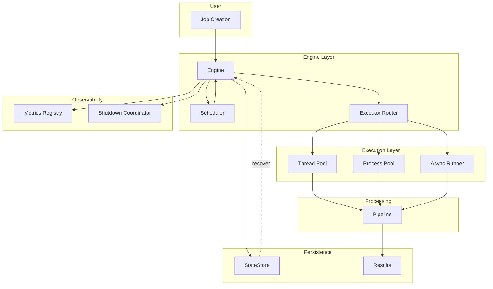
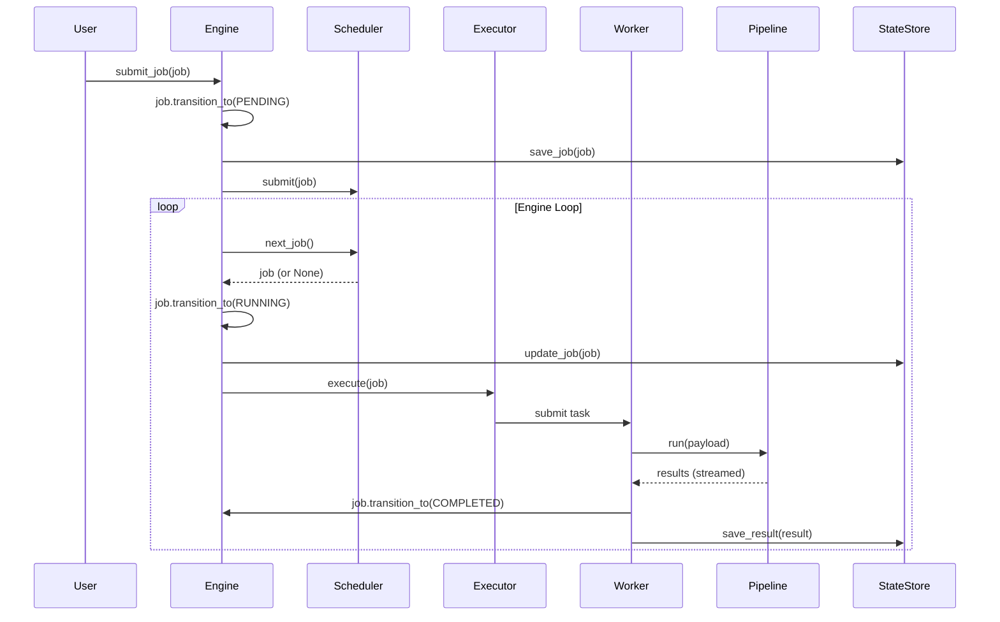
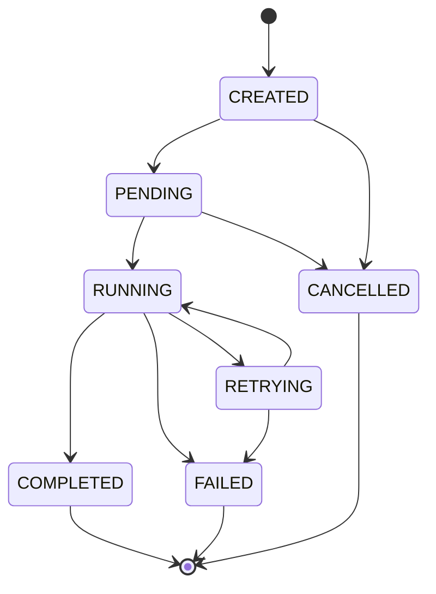
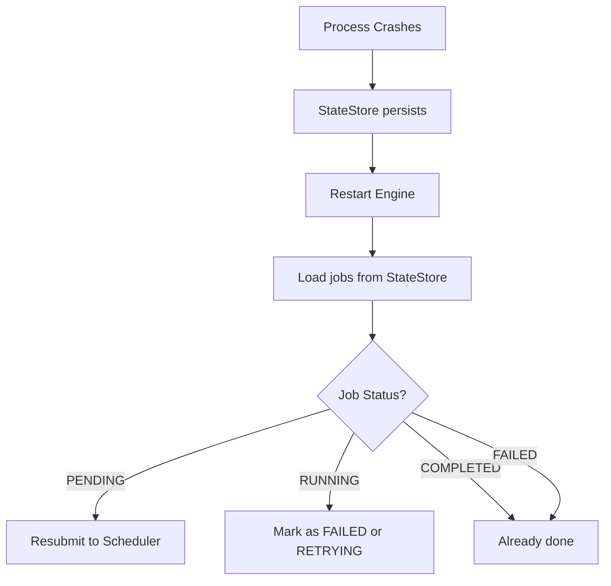

# PYREXIS Architecture

> System design, components, and failure philosophy.

---

## Table of Contents
1. [Overview](#overview)
2. [Component Architecture](#component-architecture)
3. [State Machine](#state-machine)
4. [Concurrency Model](#concurrency-model)
5. [Failure Philosophy](#failure-philosophy)
6. [Storage & Persistence](#storage--persistence)
7. [Metrics & Observability](#metrics--observability)

---

## Overview

PYREXIS is a **concurrent job execution engine** designed for reliability over performance. It prioritizes:
- **Correctness** — State transitions are enforced
- **Fairness** — No job starvation
- **Durability** — State persists across crashes
- **Observability** — Metrics for all operations

---

## Component Architecture

### High-Level Flow



---

### Component Responsibilities

| Component | Responsibility | Thread Safety |
|-----------|---------------|---------------|
| **Engine** | Job lifecycle orchestration | Yes (via Scheduler lock) |
| **Scheduler** | Priority queue with aging | Yes (threading.Lock) |
| **ExecutorRouter** | Route jobs by execution mode | N/A (stateless) |
| **ThreadWorkerPool** | Execute I/O-bound tasks | Yes (queue.Queue) |
| **ProcessWorkerPool** | Execute CPU-bound tasks | Yes (multiprocessing.Queue) |
| **Pipeline** | Multi-stage streaming | No (single-threaded per job) |
| **StateStore** | Persist jobs and results | Yes (shelve writes) |
| **MetricsRegistry** | Collect timing/counters | Yes (threading.Lock) |
| **ShutdownCoordinator** | Graceful shutdown | Yes (threading.Event) |

---

### Data Flow



---

## State Machine

### Job Lifecycle States



### Allowed Transitions

```python
ALLOWED_TRANSITIONS = {
    JobStatus.CREATED: {JobStatus.PENDING, JobStatus.CANCELLED},
    JobStatus.PENDING: {JobStatus.RUNNING, JobStatus.CANCELLED},
    JobStatus.RUNNING: {JobStatus.COMPLETED, JobStatus.FAILED, JobStatus.RETRYING},
    JobStatus.RETRYING: {JobStatus.RUNNING, JobStatus.FAILED},
}
```

Any transition **not** in this map raises `RuntimeError`.

### Retry Logic

```python
def record_failure(self, error_message: str) -> None:
    self.last_error = error_message
    self.attempts += 1
    
    if self.attempts >= self.max_entries:
        self.transition_to(JobStatus.FAILED)
    else:
        self.transition_to(JobStatus.RETRYING)
```

**Key properties**:
- Attempts increment **before** transition
- Exactly `max_entries` attempts are allowed
- Last error is always preserved

---

## Concurrency Model

### Execution Modes

| Mode | Use Case | Shared Memory | Preemption | Pickling Required |
|------|----------|---------------|------------|-------------------|
| **thread** | I/O-bound (API calls, file I/O) | Yes | OS-managed | No |
| **process** | CPU-bound (computation, parsing) | No | OS-managed | Yes |
| **async** | Event-driven (streaming, orchestration) | Yes | Cooperative | No |

### Thread Pool Implementation

```python
class ThreadWorkerPool:
    def __init__(self, num_workers: int = 4):
        self._queue = Queue()  # Thread-safe queue
        self._workers = []
        self._shutdown = threading.Event()
        
        for i in range(num_workers):
            t = threading.Thread(target=self._worker, daemon=True)
            t.start()
            self._workers.append(t)
    
    def _worker(self):
        while not self._shutdown.is_set():
            try:
                fn, args, kwargs = self._queue.get(timeout=0.5)
                fn(*args, **kwargs)
                self._queue.task_done()
            except Empty:
                continue
```

**Key properties**:
- Workers are daemon threads (exit with main process)
- Shutdown is **cooperative** (workers check flag)
- Queue timeout prevents blocking forever

### Process Pool Implementation

```python
class ProcessWorkerPool:
    def __init__(self, num_workers: int = 2):
        self._task_queue = Queue()  # Multiprocessing queue
        self._processes = []
        
        for i in range(num_workers):
            p = Process(target=self._worker, args=(self._task_queue,), daemon=True)
            p.start()
            self._processes.append(p)
    
    def shutdown(self):
        for p in self._processes:
            p.terminate()  # Force termination
```

**Key properties**:
- Processes are **isolated** (no shared memory)
- All args must be **pickleable**
- Shutdown is **forceful** (terminate, don't wait)

---

## Failure Philosophy

PYREXIS assumes **failures are common**, not exceptional.

### 1. Fail Loud
- Illegal state transitions raise `RuntimeError`
- Missing plugins raise `KeyError`
- Invalid execution modes raise `ValueError`

**No silent failures.**

### 2. Persist Early
```python
def submit_job(self, job: Job) -> None:
    job.transition_to(JobStatus.PENDING)
    self._state_store.save_job(job)  # Persist BEFORE scheduling
    self._scheduler.submit(job)
```

Jobs are saved **immediately** after state transition.

### 3. Retry Safely
- Retries have **bounded attempts**
- Exponential backoff prevents thundering herd
- Last error is **always preserved**

### 4. Never Lie with Results
```python
result = Result(
    job_id=job.job_id,
    status="COMPLETED",  # or "FAILED"
    output=final_output,
    error=str(e) if failed else None,
    started_at=started_at,
    ended_at=ended_at,
)
```

Results are **immutable** once created. A result is either:
- `COMPLETED` with `output`
- `FAILED` with `error`

Never both. Never neither.

---

## Storage & Persistence

### StateStore Design

```python
class StateStore:
    def __init__(self, path: str):
        self._path = path  # Uses Python's shelve (dbm)
    
    def save_job(self, job: Job) -> None:
        with shelve.open(self._path) as db:
            db[f"job:{job.job_id}"] = job.model_dump()
    
    def load_job(self, job_id: str) -> Optional[Job]:
        with shelve.open(self._path) as db:
            data = db.get(f"job:{job_id}")
            return Job(**data) if data else None
```

**Key properties**:
- Uses `shelve` (file-based key-value store)
- Namespaced keys (`job:`, `result:`)
- Pydantic validation on load (data integrity)

### Crash Recovery



**Note**: Current implementation does **not** auto-recover on restart. This is a future enhancement.

---

## Metrics & Observability

### Metrics Registry

```python
class MetricsRegistry:
    def __init__(self):
        self._lock = threading.Lock()
        self._counters = defaultdict(int)
        self._timings = defaultdict(list)
    
    def inc(self, name: str, value: int = 1):
        with self._lock:
            self._counters[name] += value
    
    def record_timing(self, name: str, duration: float):
        with self._lock:
            self._timings[name].append(duration)
```

### TimedBlock Context Manager

```python
with TimedBlock(metrics, "job.execution"):
    execute_job(job)

# Automatically records duration to metrics
```

### Shutdown Coordination

```python
class ShutdownCoordinator:
    def __init__(self):
        self._shutdown_event = threading.Event()
        self._callbacks = []
    
    def register(self, callback: Callable):
        self._callbacks.append(callback)
    
    def initiate_shutdown(self):
        self._shutdown_event.set()
        for callback in reversed(self._callbacks):
            callback()  # Invoke in reverse order
```

**Shutdown sequence**:
1. Engine stops pulling new jobs
2. Thread pool stops consuming queue
3. Process pool terminates workers
4. StateStore (future) flushes buffers

---

## Design Decisions

### Why no distributed support?
- Simplicity: Single-machine is easier to reason about
- Testing: Distributed systems are hard to test correctly
- Scope: Focus on concurrency, not distribution

### Why Pydantic?
- Validation: Catch errors at model creation, not execution
- Serialization: `model_dump()` works with shelve
- Type safety: IDE autocomplete and type checking

### Why shelve for storage?
- Stdlib: No external dependencies
- Simple: Key-value store is sufficient
- Replaceable: Can swap for Redis/PostgreSQL later

### Why bounded retries?
- Safety: Prevent infinite loops
- Observability: Force explicit handling of repeated failures
- Fairness: Don't block scheduler with one failing job

---

## Performance Characteristics

| Operation | Time Complexity | Thread Safe |
|-----------|----------------|-------------|
| Submit job | O(log n) | Yes (heap insert) |
| Next job | O(n log n) | Yes (aging + heapify) |
| State transition | O(1) | Yes (single-job lock) |
| Save to StateStore | O(1) amortized | Yes (shelve write) |
| Metrics increment | O(1) | Yes (lock contention) |

**Note**: Scheduler aging is O(n) on every `next_job()` call. This is acceptable for <10k jobs but would need optimization for larger scales.

---

## Future Enhancements

1. **Crash recovery** — Auto-load PENDING/RUNNING jobs on restart
2. **Dead letter queue** — Move permanently failed jobs to separate queue
3. **Streaming results** — Return partial results during pipeline execution
4. **Distributed scheduler** — Redis-backed scheduler for multi-machine
5. **Metrics export** — Prometheus/StatsD integration
6. **Web UI** — Real-time job status dashboard

---

## Conclusion

PYREXIS is designed for **correctness first, performance second**. Every design decision prioritizes:
- State machine enforcement
- Durability
- Observability
- Testability

This makes it suitable for **AI infrastructure workloads** where reliability matters more than raw throughput.

---

**For questions or contributions, see [CONTRIBUTING.md](../CONTRIBUTING.md).**
